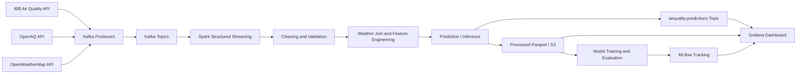

# Phase 2 Midterm Report

## Project Title

Real-Time Air Quality Monitoring and Prediction for Istanbul

## Objective

The objective of this phase is to demonstrate that the proposed solution is
feasible and that the main technical components are already under development.
The project now includes a working local infrastructure stack, data ingestion
contracts, Spark processing modules, baseline machine learning scripts,
experiment tracking plans, AWS deployment design, and Grafana dashboard design.

## 1. Revised Proposal

### Updated Problem Statement

Istanbul is a large metropolitan area with spatially and temporally variable
air pollution. Citizens, researchers, and local decision makers need an
integrated view of recent air quality conditions and near-future air quality
predictions. The project addresses this need by building a big data pipeline
that ingests air quality and weather data, processes it with Spark, trains
forecasting models, and visualizes current and predicted AQI values through a
dashboard.

The revised focus is not only to collect air quality data, but also to prove an
end-to-end data and ML workflow:

```text
Data ingestion -> Kafka -> Spark processing -> feature engineering
-> model training/inference -> prediction output -> Grafana dashboard
```

### Scope Refinement

The current implementation focuses on:

- Istanbul air quality records from IBB and OpenAQ.
- Weather enrichment from OpenWeatherMap.
- Kafka-based streaming ingestion contracts.
- Spark Structured Streaming and batch processing.
- Spark MLlib baseline and GBT forecasting models.
- MLflow experiment tracking.
- AWS-oriented storage and deployment design.
- Grafana dashboard design for station and district-level monitoring.

### Related Work Update

The project remains aligned with common air quality forecasting approaches that
combine pollutant history, meteorological variables, and temporal features.
For the midterm milestone, the implementation work has prioritized system
feasibility and pipeline proof-of-life. The final report should expand this
section with more specific papers on:

- AQI forecasting with tree-based models.
- Spatiotemporal air pollution prediction.
- Streaming analytics for environmental monitoring.
- Dashboard-based air quality decision support systems.

## 2. System Architecture and Design

### High-Level Architecture



### Main Layers

| Layer | Current implementation |
|---|---|
| Data ingestion | IBB, OpenAQ, and weather producer modules |
| Messaging | Kafka topics defined in `config/topics.yaml` and created by Docker |
| Processing | Spark Structured Streaming job and feature engineering pipeline |
| Machine learning | Baseline models, GBT model, evaluation, inference modules |
| Storage | Local `data/` convention and AWS S3 layout design |
| Tracking | MLflow local/Docker tracking plan |
| Visualization | Grafana dashboard plan with Athena/S3-oriented data model |
| Deployment | Docker Compose local stack and AWS deployment guide |

### Tech Stack

| Component | Tool |
|---|---|
| Programming language | Python 3.10+ |
| Message broker | Apache Kafka |
| Stream/batch processing | Apache Spark / PySpark |
| Machine learning | Spark MLlib |
| Experiment tracking | MLflow |
| Local orchestration | Docker Compose |
| Cloud storage | AWS S3 |
| Cloud compute | EC2 and EMR |
| Monitoring | CloudWatch |
| Visualization | Grafana |

### Infrastructure Status

The local Docker stack currently includes:

| Service | Local endpoint |
|---|---|
| Kafka | `localhost:9092` |
| Spark master UI | `http://localhost:8080` |
| Spark worker UI | `http://localhost:8081` |
| Grafana | `http://localhost:3000` |
| MLflow | `http://localhost:5001` |

The following Kafka topics were verified locally:

```text
air_quality_normalized
weather_normalized
airquality.enriched
airquality.ibb.raw
airquality.openaq.raw
airquality.predictions
airquality.system.metrics
weather.istanbul.raw
```

Relevant files:

| File | Purpose |
|---|---|
| `infra/docker-compose.yml` | Local Kafka, Spark, Grafana, and MLflow stack |
| `config/topics.yaml` | Kafka topic contract |
| `config/app.yaml` | Runtime, API, storage, and visualization configuration |
| `infra/aws/README.md` | AWS deployment and S3 layout |
| `infra/mlflow/README.md` | MLflow experiment and registry plan |
| `dashboard/grafana_dashboard_plan.md` | Dashboard data and panel design |

## 3. Implementation Status: Proof of Life

### Data Pipeline

Current data pipeline implementation includes:

- `src/ingestion/producer_ibb.py`
- `src/ingestion/producer_openaq.py`
- `src/ingestion/producer_weather.py`
- `src/ingestion/schema.py`
- `src/streaming/structured_streaming_job.py`
- `src/processing/feature_engineering.py`
- `scripts/merge_historical_data.py`
- `scripts/generate_training_data.py`

The pipeline can:

1. Normalize air quality and weather records.
2. Publish records to Kafka topics.
3. Read Kafka topics with Spark Structured Streaming.
4. Apply schema validation and cleaning.
5. Join weather and air quality data.
6. Generate lag, rolling, temporal, and spatial features.

### Data Acquisition and Cleaning Evidence

The project includes a historical data merger that can fetch and merge data
from IBB and OpenAQ:

```bash
python scripts/merge_historical_data.py
```

It also includes a synthetic training data generator for repeatable local
testing:

```bash
python scripts/generate_training_data.py
```

Cleaning and validation rules include valid AQI and pollutant ranges. Invalid
sensor readings are set to null before feature engineering.

### Baseline Model

The baseline model implementation is present:

```bash
python -m src.ml.train_baseline_models
```

Implemented baseline models:

| Model | Target |
|---|---|
| Linear Regression | `target_aqi_1h` |
| Random Forest Regressor | `target_aqi_1h` |

Model artifacts are saved under:

```text
data/models/
```

### Primary Model

The primary GBT training script is implemented:

```bash
python -m src.ml.train_gbt_model
```

Forecast horizons:

```text
1 hour
3 hours
6 hours
```

Tracked experiment:

```text
istanbul-aqi-gbt
```

### Evaluation and Inference

Evaluation script:

```bash
python -m src.ml.evaluate_models
```

Expected outputs:

```text
data/reports/evaluation_report.json
data/reports/evaluation_summary.csv
```

Inference script:

```bash
python -m src.ml.inference
```

Expected sample prediction output:

```text
data/reports/sample_predictions_1h/
```

## 4. Preliminary Results

### Current Status

The implementation is ready to produce preliminary metrics. The local
infrastructure has been started successfully, and the Kafka topic contract has
been verified. The ML pipeline contains training, evaluation, and inference
scripts, but the final metric values should be captured after running the
training/evaluation commands on the selected dataset.

### Commands to Capture Results

Run from the project root:

```bash
python scripts/generate_training_data.py
python -m src.ml.train_baseline_models
python -m src.ml.evaluate_models
python -m src.ml.inference
```

If the GBT model should also be included:

```bash
python -m src.ml.train_gbt_model
python -m src.ml.evaluate_models
```

### Metrics Table

Fill this table after running `src.ml.evaluate_models`:

| Model | Horizon | RMSE | MAE | R2 |
|---|---:|---:|---:|---:|
| Linear Regression | 1h | TBD | TBD | TBD |
| Random Forest | 1h | TBD | TBD | TBD |
| GBT | 1h | TBD | TBD | TBD |
| GBT | 3h | TBD | TBD | TBD |
| GBT | 6h | TBD | TBD | TBD |

### Qualitative Output

Expected qualitative outputs for the report:

- Kafka topics are created and visible in the local broker.
- Spark UI is available through the Docker stack.
- Grafana UI is available for dashboard implementation.
- MLflow UI is available for experiment tracking.
- Sample predictions can be exported by the inference script.

## Self-Correction and Risks

### Current Challenges

| Risk | Mitigation |
|---|---|
| Real-time external APIs may be inconsistent or rate-limited | Keep IBB as primary source and allow OpenAQ/weather to be optional |
| Direct Grafana-Kafka visualization can be fragile | Prefer S3/Athena or PostgreSQL/TimescaleDB as dashboard data source |
| MLflow local file store and Docker tracking server can diverge | Use `MLFLOW_TRACKING_URI` convention and document both modes |
| Streaming joins may need tuning for production | Use watermarks and validate join conditions during integration |
| AWS deployment may be too heavy for midterm | Keep local Docker proof-of-life and document AWS deployment path |

### Pivot Strategy

If live streaming integration is unstable before the final deadline, the system
can still demonstrate the full analytical workflow by using:

```text
historical/synthetic data -> Spark batch processing -> model inference
-> persisted predictions -> Grafana dashboard
```

This preserves the core project objective while reducing operational risk.

## Midterm Completion Checklist

| Requirement | Status |
|---|---|
| Revised problem statement | Completed in this report |
| Related work update | Needs final paper additions |
| Architecture diagram | Completed in this report |
| Tech stack finalized | Completed |
| Data pipeline proof-of-life | In progress, implementation present |
| Acquired/cleaned dataset evidence | Implementation present; output evidence should be captured |
| Baseline model v1 | Implementation present |
| Preliminary metrics | To be filled after evaluation run |
| Self-correction/pivot strategy | Completed in this report |

## References to Project Artifacts

| Artifact | Path |
|---|---|
| Architecture notes | `docs/architecture.md` |
| Data merger guide | `docs/data_merger_guide.md` |
| Engineer 1 tasks | `docs/engineer_1_data_streaming.md` |
| Engineer 2 tasks | `docs/engineer_2_ml_analytics.md` |
| Engineer 3 tasks | `docs/engineer_3_cloud_visualization.md` |
| Docker infrastructure | `infra/docker-compose.yml` |
| AWS deployment guide | `infra/aws/README.md` |
| MLflow guide | `infra/mlflow/README.md` |
| Grafana dashboard plan | `dashboard/grafana_dashboard_plan.md` |
| Topic config | `config/topics.yaml` |
| App config | `config/app.yaml` |
